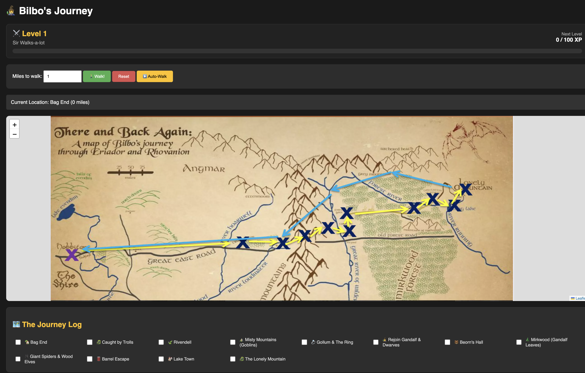

# 🧙‍♂️ Sir Walks-a-lot: The Middle-earth Journey Tracker

[](https://fastapi.tiangolo.com/)
[](https://leafletjs.com/)
[](https://www.python.org/)

> **A full-stack, interactive RPG map tracker.** Walk the 967-mile path from Bag End to the Lonely Mountain, level up in real-time, and check off milestones along the way!

---

## ✨ Features

- **🗺️ Interactive Map:** A custom image of Middle-earth with zoom controls.
- **🚶 Manual & Auto-Walk:** Walk 1 mile at a time, or hit "Auto-Walk" to watch the journey unfold automatically.
- **⚔️ RPG Leveling System:** Gain XP for every 100 meters walked. Level up using an exponential formula (100 XP for Level 2, 400 XP for Level 3, etc.).
- **✅ Journey Log Checklist:** Stops automatically check themselves off as you pass them.
- **🖥️ Full-Stack Architecture:** FastAPI backend handling data, and a vanilla JS + Leaflet.js frontend.

---

## 📸 Demo



---

## 🚀 How to Run Locally

1. **Clone the repository:**
   ```bash
   git clone https://github.com/YOUR_USERNAME/bilbo-journey.git
   cd bilbo-journey